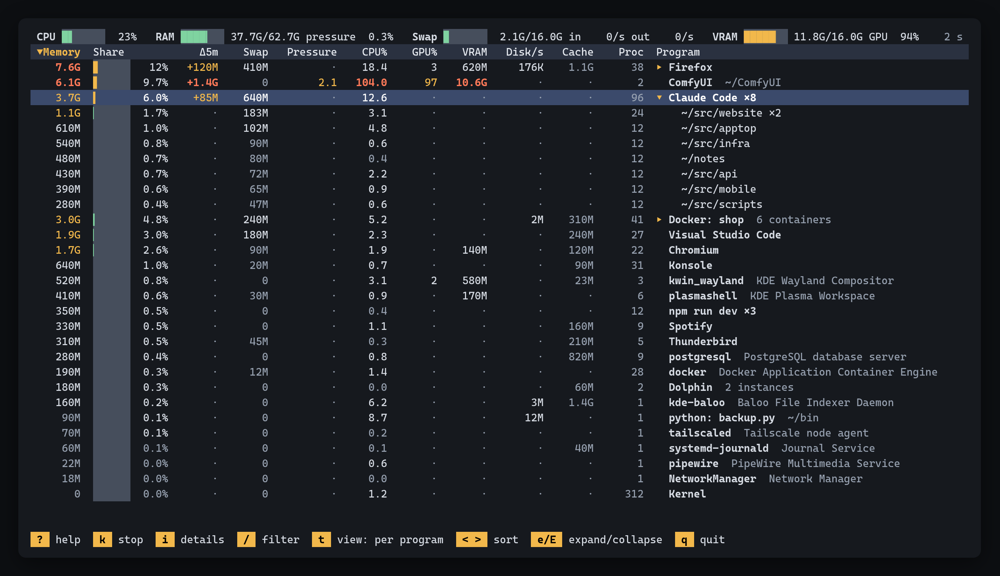

# apptop

A per-application resource monitor for Linux. Where htop shows one row per process, apptop
shows one row per program: a browser with 90 renderer processes, a terminal running two dozen
sessions, a docker compose stack or a Python app with worker processes each become a single
row with totals you can compare, and expand into their parts when you want the detail.



<sub>Demo data (`APPTOP_DEMO=1`); regenerate with `scripts/screenshot.sh`.</sub>

## What it shows

- **One row per program**, built from the cgroups systemd, the desktop and docker already
  create: apps launched from the desktop (`app-*.scope` / `app-*.service`), user and system
  services, docker containers grouped by compose project, the kernel.
- **Readable names** from `.desktop` entries and unit descriptions; interpreters are named by
  their script (`python: server.py`, `java: app.war`, `npm run dev`); each Chromium-based browser
  profile gets its own row.
- **Programs started in terminals get their own rows** (merged by name, e.g. `Claude Code ×26`
  with one child per working directory) instead of hiding under the terminal. Press `t` to show
  them under their terminal, grouped by zellij session.
- **Columns:** memory the kernel cannot reclaim, share of the total, change over 5 minutes,
  swap, memory pressure (PSI), CPU%, GPU% and VRAM (NVIDIA), disk I/O, file cache, process
  count. Click a header or press its key to sort.
- **Details panel** (`i`): the largest process's command line, working directory, parent, age
  and a 10-minute memory sparkline.
- **Stopping programs** (`k`): a confirmation panel lists exactly what stops, built from live
  state. See [Stopping programs](#stopping-programs).
- **Filter** (`/`) by name or directory.

## Requirements

- Linux with the unified cgroup v2 hierarchy (the default on current systemd distributions).
- A systemd user session for per-application grouping. KDE Plasma and GNOME launch apps into
  their own scopes; without that, apps fall under their parent's service.
- Optional: the NVIDIA driver (NVML) for the GPU columns, and access to the docker socket for
  container names.

Developed and tested on an Arch-based KDE Plasma desktop with an NVIDIA GPU.

## Install

```bash
cargo install --git https://github.com/emoryy/apptop
```

or from a checkout:

```bash
cargo build --release
install -m755 target/release/apptop ~/.local/bin/
```

Rust 1.88 or newer.

## Usage

```
apptop [-d SECONDS] [--split] [--lang en|hu] [--dump [--depth N]]

  -d, --delay SECONDS  refresh interval (default 2)
  --split              keep programs started in terminals under the terminal
  --lang en|hu         interface language (default: from LANG)
  --dump               print the tree once and exit
  --depth N            levels to print with --dump (default 1)
```

| Key | Action |
|---|---|
| `↑` `↓` `PgUp` `PgDn` `Home` `End` | move |
| `→` `←` `Enter` | expand, collapse |
| `e` / `E` | expand / collapse everything |
| `M` `D` `S` `W` `P` | sort by memory, change, swap, pressure, CPU |
| `G` `V` `O` `C` `N` | sort by GPU%, VRAM, disk, cache, name |
| `<` `>` / `I` | previous / next sort column, invert direction |
| `k` / `F9` | stop the selected row (asks first) |
| `i` / `F3` | details panel |
| `/` | filter, `Esc` clears |
| `t` | programs started in terminals: own rows / under the terminal |
| `?` / `F1` | help |
| `q` / `F10` | quit |

The mouse works too: click a column header to sort, double-click a row to expand it.

Sort column, direction, view mode and the details panel are remembered in
`~/.config/apptop/config`.

## How the numbers are computed

| Column | Program row (a cgroup) | Rows below it (processes) |
|---|---|---|
| Memory | anon + shmem + unreclaimable kernel memory from `memory.stat` | RssAnon + proportional share of shared memory |
| Swap | `memory.swap.current` | VmSwap |
| Cache | file cache from `memory.stat` | not shown |
| CPU% | `cpu.stat` (includes exited children); 100% = one core | per-process CPU time |
| Pressure | `memory.pressure` some avg10 | not available |
| GPU% / VRAM | NVML, summed over the program's processes | same |
| Disk/s | `/proc/<pid>/io` read and write bytes, own processes only | same |

The cgroup totals include kernel memory and exited children, which no single process accounts
for, so each breakdown ends with an "other" row holding the difference. More detail on the
grouping rules is in [NOTES.md](NOTES.md).

## Stopping programs

`k` opens a panel that names the row, its kind, the cgroup or containers affected, and the
first processes with their command lines. SIGTERM is the default; `Tab` switches to SIGKILL.

| Row | SIGTERM | SIGKILL |
|---|---|---|
| application or user service | every process in its cgroup | `cgroup.kill` |
| program started in a terminal, single process | those processes | same |
| docker container or compose group | `docker stop` | `docker kill` |
| system service, another user's process | refused | refused |

Processes are identified by PID and start time, so a PID reused in the meantime is never
signalled. Rows that stand for several programs (`Claude Code ×26`, a whole compose project)
can be stopped too; the panel states how many programs, processes and containers that means,
and warns if apptop's own terminal is among them. apptop never calls sudo.

## Language

English by default; Hungarian when the locale starts with `hu` (`LC_ALL`, `LC_MESSAGES` or
`LANG`), or with `--lang hu`.

## License

Licensed under either of [Apache License, Version 2.0](LICENSE-APACHE) or
[MIT license](LICENSE-MIT) at your option.
